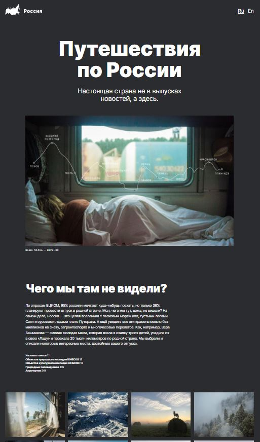

<h1 align="center">Traveling around Russia</h1>
<table border="1">
  <tr>
    <td>
      
<strong>Project «Traveling around Russia» is an responsive site for planning trips around Russia with a lot of photos.</strong>

      
Tools: Html, CSS, Flexbox, Grid, CSS-animation

      
The project has the following functions: 

      <ul>
        <li>Layout according to BEM methodology;</li>
        <li>Adaptability at different resolutions, including breakpoints;</li>
        <li>Using grid and flex technologies;</li>
        <li>Pseudo-classes and pseudo-elements, animation to create interactivity;</li>
        <li>Variety of semantics;</li>        
      </ul>
      
The result <a href="https://zulfiyakurmanaeva.github.io/russian-travel/index.html" target="_blank">here</a> or you can click on the image on the right.

      
***

      
<strong>«Путешествия по России»</strong>

      
Сайт о необычных направлениях, которые могут быть выбраны в качестве туристических маршрутов по России

      
Функционал: Адаптивный интерфейс для разных устройств.

      
Стек: HTML5, CSS3, Flexbox, Grid Layout, БЭМ.

      
<a href="https://zulfiyakurmanaeva.github.io/russian-travel/index.html" target="_blank">Ссылка на сайт</a>

      </td>
    <td>
      
Click preview

      
    </td>
  </tr>
</table>
